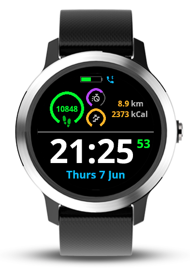

# Introduction
Garmin VivoActive 3 Watchface. 

Time and date are clearly visible.

Also shows:
- Number of steps and progress towards daily step goal
- Battery status
- Connection to phone
- Distance and kCal for current day

# ToDo
- Localization
- Make configurable

# Credits 
Icons made by Freepik from www.flaticon.com 
